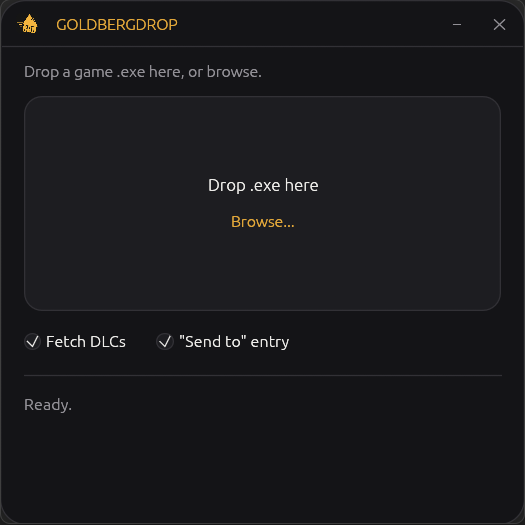
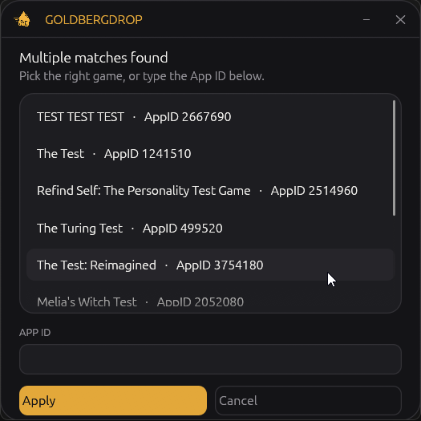
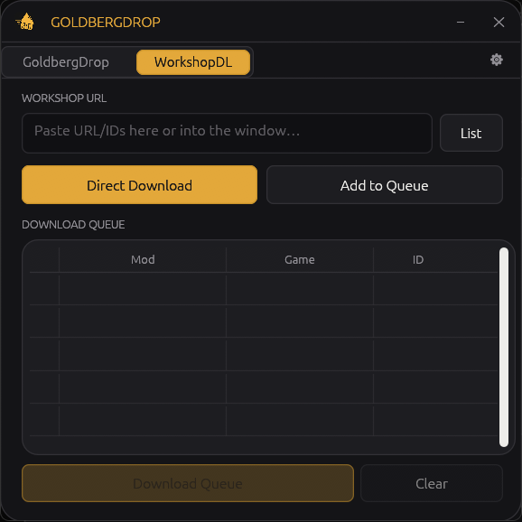
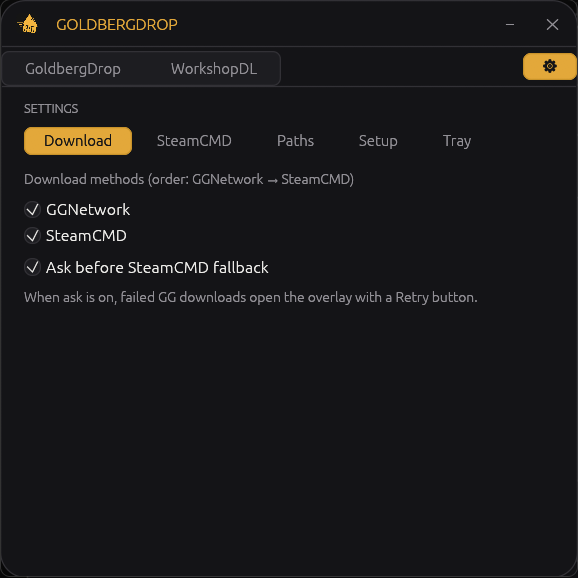

<p align="center">
  
</p>

<h1 align="center">GoldbergDrop</h1>

<p align="center">
  Drop a game <code>.exe</code> → find the Steam App ID → set up<br>
  the <a href="https://mr_goldberg.gitlab.io/goldberg_emulator/">Goldberg Steamworks emulator</a>. No manual config editing.
</p>

<p align="center">
  
  &nbsp;
  
</p>
<p align="center">
  
  &nbsp;
  
</p>

---

## What it does

1. **Drop** a game `.exe` (or Browse… / Explorer **Send to → GoldbergDrop**).
2. **Look up** the Steam App ID (exe name → folder → path). Pick from a list if needed, or type the ID.
3. **Apply Goldberg** in the game folder:
   - `steam_appid.txt`
   - `steam_settings/` (optional DLC list + achievements)
   - replace `steam_api.dll` / `steam_api64.dll` (searches subfolders too)

Games you set up also appear in the **tray launcher** for one-click start.

## Why

Goldberg is an offline Steamworks reimplementation. Useful when you want to:

- play without Steam running
- keep a game working after store/server shutdown
- LAN-test while modding

GoldbergDrop only automates setup — it never ships game files.

## Features

| Area | What you get |
| --- | --- |
| **Setup** | Drag & drop, Browse, Send to, CLI path · App ID lookup · DLC / achievements · recursive DLL swap |
| **GreenLuma** | Install Steam006 (PW zip + SHA256) · CSF library import · AppList · inject / plain Steam · download watch |
| **WorkshopDL** | Queue downloads via [GGNetwork](https://ggntw.com/steam) · SteamCMD fallback · bulk paste / list import |
| **Tray** | Launch tracked games · Steam with / without GreenLuma · close-to-tray · autostart · auto-inject |
| **Settings** | Providers, SteamCMD, Steam paths, Setup defaults, tray / auto-inject |

## Download

- Get `goldberg-drop.exe` from **[Releases](../../releases)**
- Single portable file — no installer, no API key
- Needs internet for lookups, optional DLC/Workshop, and the one-time Goldberg download (then cached)
- **[7-Zip](https://www.7-zip.org/) must be installed** for GreenLuma install and CSF pack import (`7z.exe` in Program Files or on PATH)

> SmartScreen may warn (unsigned) → **More info → Run anyway**

---

## Usage

### Goldberg setup

| Screen | Action |
| --- | --- |
| Idle | Drop a `.exe` or **Browse…** |
| Multiple matches | Pick a game or edit the App ID → **Apply** |
| No match | Enter the App ID manually |
| Done | **Set up another game** if you want |

Enable **"Send to" entry** once on the Setup tab to add GoldbergDrop to Explorer’s Send to menu.

### GreenLuma

Alternative to Goldberg: run Steam with [GreenLuma](https://cs.rin.ru/) (Steam006) via DLLInjector (stealth any-folder).

**Requires [7-Zip](https://www.7-zip.org/)** — without `7z.exe`, GreenLuma install and CSF archive import will fail.

1. Open the **GreenLuma** ribbon tab → **Install GreenLuma** (allow/exclude the `greenluma` folder under AppData in Defender first — injector DLLs often false-positive).
2. Bundled archive is password-protected and **SHA256-whitelisted**; modified binaries are rejected.
3. Drop a CSF / Orb-style pack (`steamapps/appmanifest_*.acf` + `steamapps/common/<installdir>/` + `depotcache/`) to merge into your Steam library and AppList. Optional archive password field (remembers working passwords; tries `cs.rin.ru`).
4. Or drop a game `.exe` to look up the AppID and add it to AppList.
5. **Start Steam with GreenLuma** launches `DLLInjector.exe`.

Optional **"Send to" entry (GreenLuma)** creates `GoldbergDrop (GreenLuma).lnk` (`--greenluma`).

Under **Settings → Tray**: **Start Steam with GreenLuma when GoldbergDrop starts** replaces Steam’s Windows Run autostart with GoldbergDrop (`--tray`), then injects Steam on each GBD launch. Unchecking restores the previous Steam Run entry.

Steam path is auto-detected (registry → common paths); override under **Settings → Paths**.

#### Play mode vs update mode

GreenLuma is great for playing unlocked AppList games; Steam updates/downloads often fail while injected.

| Mode | How | Use for |
| --- | --- | --- |
| **Play (GreenLuma)** | Tray → *Start Steam with GreenLuma*, or auto-inject | Playing AppList games |
| **Maintain (plain)** | Tray → *Start Steam without GreenLuma* | Updates, Workshop, Verify, Store |

If Steam starts a download/update while the last launch was GreenLuma, GoldbergDrop prompts to restart **without** GreenLuma. The prompt waits until you **quit the game** so it does not interrupt play.

### Tray & launching games

After a **successful Goldberg setup**, the game is tracked automatically (path + icon).

| Action | Result |
| --- | --- |
| **Right-click** tray icon → game name | Starts that game’s `.exe` |
| **Right-click** → Start Steam with / without GreenLuma | Restarts Steam in that mode (when GreenLuma is installed) |
| **Right-click** → Open GoldbergDrop | Shows the main window |
| **Right-click** → Quit | Exits the app |
| **Left-click** tray icon | Only restores the window (does not launch a game) |

- Remove games under **Settings → Tray**
- **Close to tray**: ✕ hides to the notification area instead of quitting
- **Autostart**: starts hidden with `--tray` at Windows logon
- **Single instance**: a second launch (or Send to) forwards to the running app

### WorkshopDL

1. Paste Workshop URLs or IDs (or use **List** for many).
2. **Add to Queue** / **Direct Download**.
3. Run **Download Queue**.

GGNetwork is tried first; SteamCMD is the fallback.  
Files go to `WorkshopDownloads/{Game}/` next to the exe (change under Settings → Paths).

### Settings

Open **⚙** on the ribbon:

**Download** · **SteamCMD** · **Paths** · **Setup** · **Tray**

Config, GreenLuma install, and cache live in:

`%APPDATA%\GoldbergDrop\GoldbergDrop\data\`

---

## Building from source

Requires a recent stable [Rust](https://www.rust-lang.org/) toolchain (MSVC) on Windows.

```bash
cargo build --release
```

Output: `target/release/goldberg-drop.exe`

## Built with

[egui](https://github.com/emilk/egui) / [eframe](https://github.com/emilk/egui) · [tray-icon](https://github.com/tauri-apps/tray-icon) · [Goldberg Emulator](https://mr_goldberg.gitlab.io/goldberg_emulator/) · see `Cargo.toml`

## Disclaimer

Setup helper for Goldberg / GreenLuma tooling — use with games you own. Goldberg and GreenLuma are third-party projects; GreenLuma binaries ship unmodified in a password-protected archive for integrity checks only. See their respective communities for licensing and terms.
