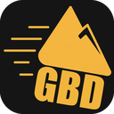

<p align="center">
  
</p>

<h1 align="center">GoldbergDrop</h1>

<p align="center">
  Drag a game's <code>.exe</code> onto the window, and GoldbergDrop finds its Steam App ID and<br>
  sets up the <a href="https://mr_goldberg.gitlab.io/goldberg_emulator/">Goldberg Steamworks emulator</a> for it — no manual config editing required.
</p>

---

## What it does

1. You drop a game's `.exe` (or pick it via "Browse...", or right-click it and choose **Send to → GoldbergDrop**).
2. GoldbergDrop looks up the game's Steam App ID automatically — first by the exe's file name, then by its folder name, then by the full path — using Steam's public store search. If several games match, you get to pick the right one from a list (or type the ID yourself).
3. It downloads and caches the latest [Goldberg emulator](https://mr_goldberg.gitlab.io/goldberg_emulator/) build, then in the game's folder:
   - writes `steam_appid.txt`
   - creates a `steam_settings/` folder (with a DLC list, if you enabled "Fetch DLCs")
   - backs up and replaces `steam_api.dll` / `steam_api64.dll` with the Goldberg build (searching subfolders too, if the DLL isn't next to the exe)

That's it — one drop, done.

## Why you'd want this

Goldberg is an open-source, offline reimplementation of the Steamworks API. Typical reasons to point it at a game you own:

- Play or LAN-test a game without Steam running, e.g. on a machine that's offline.
- Keep a game working after its Steam servers, DRM activation, or store listing has been shut down.
- Local co-op/LAN multiplayer testing during modding or development.

GoldbergDrop just automates the repetitive part of that setup (finding the App ID, editing files, swapping the DLL) — it doesn't include or download any game files, only the Goldberg emulator itself.

## Features

- **Drag & drop or browse** — no command line, no config files to hand-edit.
- **Automatic Steam App ID lookup** with a fallback picker when multiple games match, and a manual entry field if nothing is found.
- **Optional DLC list** fetched from Steam so DLC-gated content unlocks correctly.
- **Recursive DLL search** — finds `steam_api(64).dll` even if it's tucked away in a subfolder.
- **Right-click "Send to" integration** — enable it once from a checkbox, then send any `.exe` to GoldbergDrop straight from Explorer's context menu.
- Small (420×420), borderless, always-on-top-free custom UI — no installer, no background service.

## Download

Grab `goldberg-drop.exe` from the [Releases](../../releases) page and run it — that's the whole install. It's a single, self-contained executable:

- No installer, no .NET/VC++ redistributable, no bundled DLLs — everything it links against ships with Windows 10/11 itself.
- No Steam Web API key or account needed; it only uses Steam's public store search.
- Needs internet access for the App ID lookup, the optional DLC fetch, and the one-time Goldberg emulator download (cached afterwards in `%LOCALAPPDATA%`).

> Since the exe isn't code-signed, Windows SmartScreen will likely flag it as "Unknown publisher" on first run — click **More info → Run anyway**.

## Usage

| Screen | What to do |
|---|---|
| Idle | Drop a `.exe`, or click **Browse...** |
| Multiple matches | Pick the right game from the list, or type/edit the App ID at the bottom, then **Apply** |
| No match found | Enter the Steam App ID manually |
| Done | You're set — "Set up another game" to do another one |

Check **"Send to" entry** once to add GoldbergDrop to Explorer's right-click **Send to** menu for any file. If you later move `goldberg-drop.exe`, the app will tell you the entry went stale with a one-click fix.

## Building from source

Requires a recent stable [Rust](https://www.rust-lang.org/) toolchain (MSVC target) on Windows.

```bash
cargo build --release
```

The resulting binary is at `target/release/goldberg-drop.exe`, with the app icon already embedded (via `build.rs` + [`winresource`](https://crates.io/crates/winresource)) and inherited by the "Send to" shortcut.

## Built with

- [egui](https://github.com/emilk/egui) / [eframe](https://github.com/emilk/egui) for the UI
- [Goldberg Steamworks Emulator](https://mr_goldberg.gitlab.io/goldberg_emulator/) by Mr. Goldberg
- [`rfd`](https://crates.io/crates/rfd), [`reqwest`](https://crates.io/crates/reqwest), [`mslnk`](https://crates.io/crates/mslnk), and a handful of other great Rust crates — see `Cargo.toml`

## Disclaimer

GoldbergDrop is a setup helper for the Goldberg emulator. It doesn't provide, crack, or distribute any game files — use it only with games you legitimately own. Goldberg itself is a third-party project; see its site for details and licensing.
